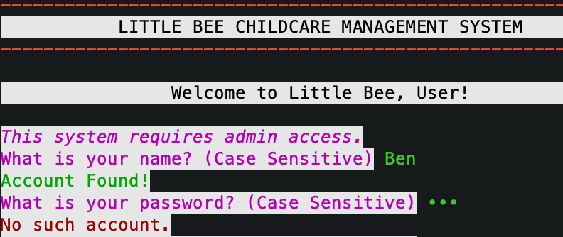
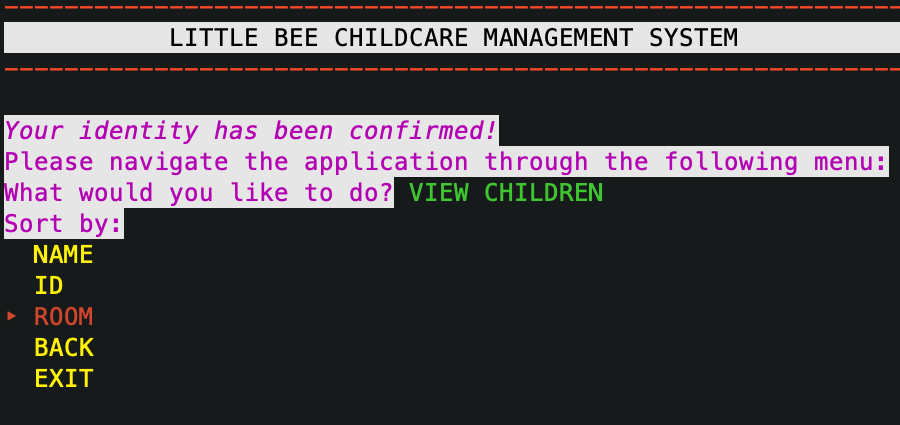
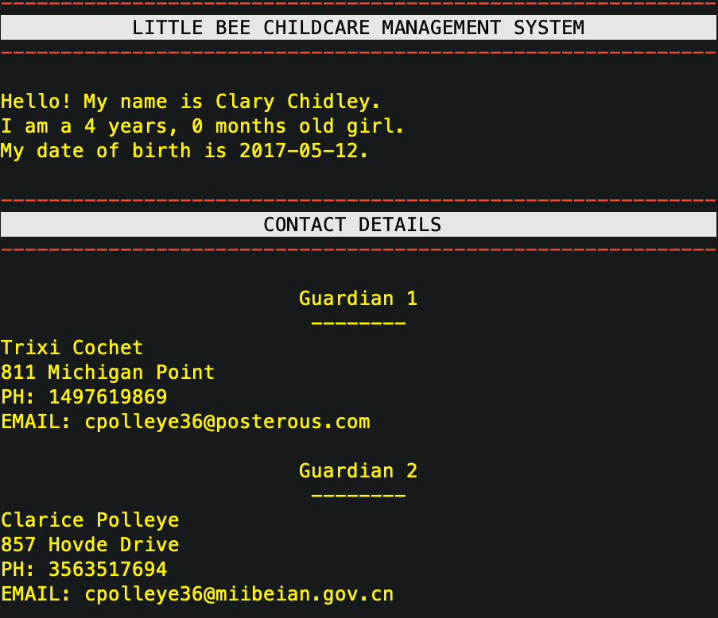
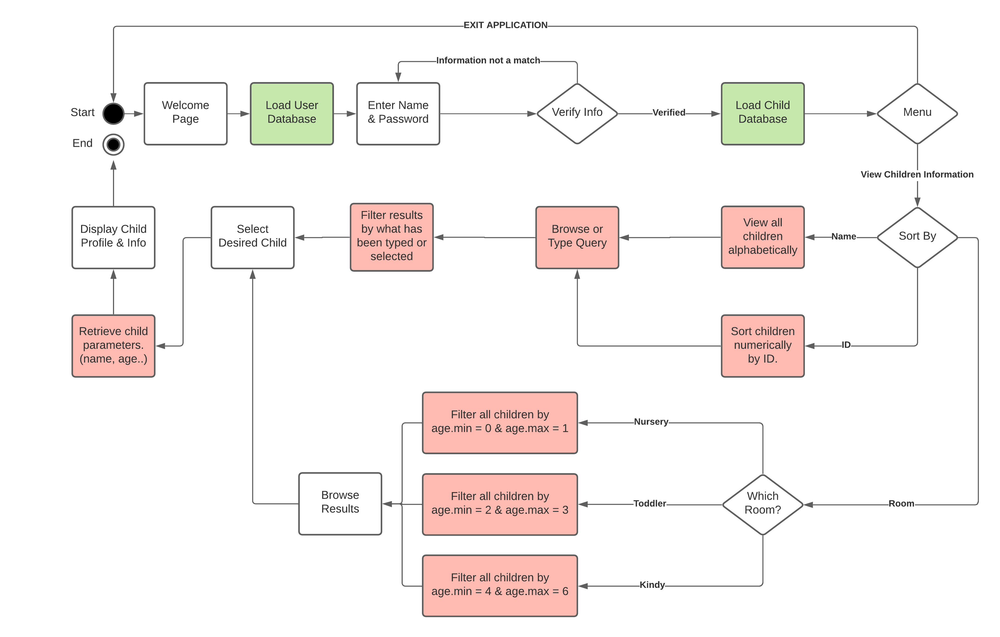

# Little Bee - Childcare Management System v0.1
A CLI program built completely in Ruby.
By Ben Flint.

# Github Link
https://github.com/flintzb/little-bee

## Software Development Plan
### Description
Little Bee is a CLI application that allows the client to speak to and read from a database full of information about children within a childcare centre with speed and ease. Each child has a profile that contains information about them and their family, and this information is dynamically pulled from the database at each instance. You could theoretically replace the database with any other database (that has the same column names) and it will work the same!
This application was developed with the intention of learning how to manipulate a database with Ruby, specifically PostgresQL. It's NOT a requirement for the client to host their own instance of PostgresQL as I have set up a server online using DBaaS providers. I personally used Azure, but there other providers such as AWS, Heroku & ElephantSQL that offer similar offerings.
### Purpose
Information management plays a large role within childcare as the industry is surrounded by laws and regulations, as well as being a sensitive industry in general. Records need to be kept for a minimum of 3 years even after a child has left and fast, simple access to information can play a crucial role in managing the information input and output of a business that may need to cater for over 100 children on a daily basis. The application isn't designed to look pretty, but is designed to minimise the steps required to finding access the desired information about a child. 

### Target Audience and Scenario of Use.
The target audience are employees of the childcare industry. Whether it be a:
-	Centre cook who needs to quickly find out whether a child is allergic to dairy.
-	or a Teacher who wants to find out Bobby's father's email so she can email her reports.
-	or an Administrator who would like to find out how old a child is, so she can be moved up on her birthday!
-	or a Director who needs to find phone information to discuss a certain issue.
In short, the target audience are employees of the childcare industry who are required to access information as a requirement of their role at work.

## Features

### Secure Login System
Little Bee is connected to PostgreSQL in two instances. In this first instance, we take the response of the client for "username" and "password" fields and compare them to a previously pulled hash of both fields. Doing it this way, secures our application from SQL injection concerns. 
If the entered username and password match, the user will be redirected to the next stage of the application. 
If not, they will be prompted to try again.
<br>



### View All Children & Filter
Once the identity of the user has been confirmed, they will be able to select how they would like to view the database. They can view by Room, ID or Name, each triggering an algorithm that will sort and generate each child as a menu option in a sorted manner. 
<br>



### View Child Information
Last but not least, once a child has been selected through any of the sorting algorithms above, their entire profile will be generated with accurate, real time data.
<br>



## User Interactions

The user interactions for this application are extensively controlled by the Ruby Gem, "tty-prompt". I chose this gem as it provides an easy form of navigation that is easy to use for both the developer and the client.

1. The user is introduced to a welcome page with the name of the application decorized in colour at the very top. The user is welcomed by: 
```
Welcome to Little Bee, User!
```
2. In the same page, the application informs the user that there is a restriction to who may access this information, as it is sensitive. Therefore the application will ask the user for a required response for their name. If the user name and password match the database given, the application allows access to the second stage of Little Bee with a confirmation message and a second prompt to navigate the application. 
```
Your identity has been confirmed!
Please navigate the application through the following menu:
```
3. Users can continue to navigate through the application through use of TTY prompt. An interesting use of TTY prompt has been that in the database section of the application, each menu option is related to the appropriate object of the class Child. Each menu option is "generated" from the database, and not typed in manually. 
```
  BACK
‣ ID: 1 | Lindon De Lasci
  ID: 2 | Nicolas Sheardown
  ID: 3 | Jose Heimes
```
4. Finally, when the user has sorted through the child database, appropriate information about the child will be pulled out in response to the option that has been selected. For example, Selecting the name "Lindon De Lasci" will then look for the child profile with the "ID" attribute of 1. And in response, will print out the appropriate information of the child selected, with no further input required from the user. 

## Control Flow Diagram



## Implemenation (Trello)


## Installation

To run this application simply put 
```
bash little_bee.sh
```
In a CLI with BASH/ZSH.
Ruby (2.7.0+) and Bundler are also required.

To find out how to install Ruby, click [here](https://www.ruby-lang.org/en/downloads/).

To find out how to install Bundler, click [here](https://bundler.io/).

If for some reason you encounter any issues with the bash script, navigate to the file directory "src" within the project in your CLI and input the following commands.
```
gem install bundler
```
```
bundle install
```
```
ruby main.rb
```
